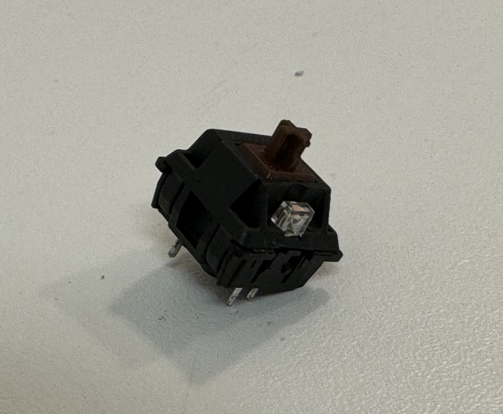

# The Original

Varmilo VA88M Sakura MX Brown (TKL)

Great keyboard, but has a terrible "ping" sound when releasing the keys. This ping seems to be resolved in the V2/USB-C variant of the keyboard using foam betwwen the plate and the PCB.

# The Plan

1. Open the keyboard casing
2. Desolder the switches and the LEDs
3. Fit special hot swap sleeves in the original solder holes for the switches
4. Resolder LEDs flush against the PCB
5. Place switch foam on the PCB
6. Place plate foam on the steel plate
7. Reassemble

## Step 1. Opening the Keyboard

Using a PH1 screwdriver, six screws are removed from the underside of the keyboard. A metal spudger may then be used along the top and bottom split line in order to safely unlatch the plastic tabs holding the top and bottom halves together.

After this, the connector board may be disconnected and the PCB and plate assembly is free.

## Step 2. Desoldering the switches and the LEDs

Using a desoldering iron, it is possible to remove solder from each pin relatively quickly. Ideally, one would use a hot air gun for this.

Varmilo really does not want you to desolder the switches. By placing the LED above the switch, it is impossible to remove it without also removeing the LED.

After all of the switches and LEDs are removed, the plate assembly is removed using pliers straightening the bent metal flanges holding it to the PCB.

## Step 3. Fitting special hot swap sleeves in the original solder holes for the switches

The hot swap sleeve requires 1.45mm holes while the original holes are ~1.3mm in diameter. A 1.5mm drill is used to enlarge the holes. 

This carries the risk of destroying the PCB. Fortunately the PCB is only dual layer and the solder pads around the holes are generously sized.

## Step 4. Resoldering LEDs flush against the PCB

Keyboard switches usually have a good amount of space in the location of the LED, so there is no reason to repeat what Varmilo did - soldering the LEDs above the swtiches. This is good, as we then are able to have hot swappable switches while still having LEDs in the keyboard.

The first test was somewhat successful, only a few LEDs were damaged in the removal process. Ideally, one should have removed the switches and LEDs with a hot air gun. Then all the LEDs would have survived the transplant. I broke some of them in the removal process.

To be continued...

## Step 5. Placing switch foam on the PCB

## Step 6. Placing plate foam on the steel plate

## Step 7. Reassembly
